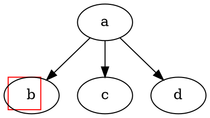

# dot

> [Xdot文档](https://graphviz.org/docs/outputs/canon/#xdot)

如下的方式可以在背景中生成一个红色的正方形




其中控制_background的属性的就是Xdot节点: "c 7 -#ff0000 p 4 4 4 36 4 36 36 4 36"

Xdot的参数大概分为如下几种

> 其中开头的字母为缩写,以及对应的标识符.n为点的数量,x1


- 填充的多边形: `P n x1,y1,...`
- 不填充的多边形: `p n x1,y1,...`
- 不闭合的多边形: `L n x1,y1,...`
- 填充的椭圆: `E x0 y0 w h`

  ((x-x0)/w)² + ((y-y0)/h)² = 1

- 不填充的椭圆: `e x0 y0 w h`
- 贝塞尔曲线: `B n x1,y1,...`
- 填充的贝塞尔曲线: `b n x1,y1,...`

和设置类属性,这里的n代表几位比特位,例如 C 7 -#ff0000, n=7表示读取 - 后面七位作为颜色

- 填充的颜色: `C n -b1b2b3`(只对启用了填充的图形有效)
- 画笔颜色: `c n -b1b2b3`
- 字体: `F s n -b1b2b3`

  字体大小由s确定,字体名字由n比特(b1b2b3)确定

- 字型: `t f`, 其中f为整数,其对应表如下


```dot
digraph G {
  _background="c 7 -#ff0000 C 7 -#ff0000 b 4 4 4 36 4 36 36 4 36";
}
```


