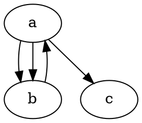
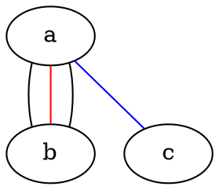
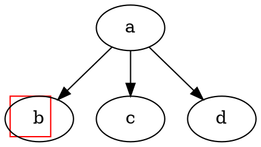

# dot


## DOT

DOT是一门用于定义 Graphviz 节点、边、图、子图和簇的抽象语法,它并不是一门编程语言,只是一种graphviz定义的描述型语言


DOT完整的语法描述如上图所示,但是以这种方式入门显然并不合适,在一开始也并不需要掌握及其精细的调控方式

在本节中我们仅作简单介绍,我们将在下一小节中详细介绍DOT作图

如上一节中编写的 ast.dot, DOT有如下几个特点

- 文件结尾为.dot
- 关键字大小写无关
- 允许命名ID, ID的命名规范与C比较类似
- 与C相同的注释支持(//和/**/) + #
- 至少支持ASCII字符集,默认支持uft-8

如下创建一个有向图,完成简单的图连线




如下创建一个无向图,并修改一些线的颜色




dot同样支持命令行的输出,可以从文件或stdin接收输入

将结果保存到output.svg

```bash
echo 'digraph { a -> b }' | dot -Tsvg > output.svg
```

输出到终端

```bash
echo 'digraph { a -> b }' | dot -Tsvg -Gfontcolor=red -Glabel="My favorite letters"
```

接收文件输入保存到文件

```bash
dot -Tpng ./dot/01.dot -o aaa.png
```

其中-T后面为文件格式,graphviz支持包括bmp,gif,jpeg,png,tga在内的[众多格式](https://graphviz.org/docs/outputs/)

一种更为便捷的图片生成方式

```bash
dot -Tpng -O ./dot/01.dot
```

这种方式会在01.dot同目录下生成一个和01同名的01.png

## Xdot

> [Xdot文档](https://graphviz.org/docs/outputs/canon/#xdot)

如下的方式可以在背景中生成一个红色的正方形




其中控制_background的属性的就是Xdot节点: "c 7 -#ff0000 p 4 4 4 36 4 36 36 4 36"

Xdot的参数大概分为如下几种

> 其中开头的字母为缩写,以及对应的标识符.n为点的数量,x1


- 填充的多边形: `P n x1,y1,...`
- 不填充的多边形: `p n x1,y1,...`
- 不闭合的多边形: `L n x1,y1,...`
- 填充的椭圆: `E x0 y0 w h`

  ((x-x0)/w)² + ((y-y0)/h)² = 1

- 不填充的椭圆: `e x0 y0 w h`
- 贝塞尔曲线: `B n x1,y1,...`
- 填充的贝塞尔曲线: `b n x1,y1,...`

和设置类属性,这里的n代表几位比特位,例如 C 7 -#ff0000, n=7表示读取 - 后面七位作为颜色

- 填充的颜色: `C n -b1b2b3`(只对启用了填充的图形有效)
- 画笔颜色: `c n -b1b2b3`
- 字体: `F s n -b1b2b3`

  字体大小由s确定,字体名字由n比特(b1b2b3)确定

- 字型: `t f`, 其中f为整数,其对应表如下


```dot
digraph G {
  _background="c 7 -#ff0000 C 7 -#ff0000 b 4 4 4 36 4 36 36 4 36";
}
```


