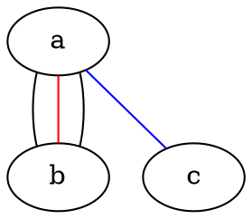

# 快速开始

对于源码可以在 [此处](https://graphviz.org/download/source/) 找到

```bash
./configure --prefix=<path/to/install>
make
make install
```

对于基本使用来说直接 apt 下载即可

```bash
sudo apt install graphviz
```

但对于开发来说我们需要其 include/ 头文件和 lib/ 静态库, 您可从源码编译得到

```bash
build/
├── bin
├── include
├── lib
└── share
```

或者直接安装graphviz开发版本

```bash
sudo apt install graphviz-dev
```

安装后 graphviz头文件的位置为 `/usr/include/graphviz`, 静态库安装在 `/lib/x86_64-linux-gnu/`, 静态库名分别是 `gvc` `cgraph` `cdt`

笔者个人习惯是使用 pkg-config 来管理第三方库

```bash
sudo apt install pkg-config
```

得到如下的 Makefile 用于自动化编译

```Makefile
CFLAGS=`pkg-config libgvc --cflags` -Wall -g -O2
# -I/usr/include/graphviz

LDFLAGS=`pkg-config libgvc --libs`
# -lgvc -lcgraph -lcdt

main: main.c
    $(CC) $^ $(CFLAGS) $(LDFLAGS) -o $@
```

Windows 下配置路径同理类似, 不再赘述. 

后面的代码默认都运行在 Linux 系统中, 笔者运行环境为 WSL2(Ubuntu22.04)

## Vscode

首先在vscode插件市场搜索graphviz并且下载两个插件

其中language support提供dot语言的高亮显示,preview可以提供预览

安装完成之后可以看到ast.dot文件完成了部分语法高亮,并且可以在右上角预览graphviz渲染之后的效果(ctrl+k v)

除此之外还可以使用graphviz官方提供的在线编辑网站 http://magjac.com/graphviz-visual-editor/ 实时预览


## DOT

DOT是一门用于定义 Graphviz 节点、边、图、子图和簇的抽象语法,它并不是一门编程语言,只是一种graphviz定义的描述型语言


DOT完整的语法描述如上图所示,但是以这种方式入门显然并不合适,在一开始也并不需要掌握及其精细的调控方式

在本节中我们仅作简单介绍,我们将在下一小节中详细介绍DOT作图

如上一节中编写的 ast.dot, DOT有如下几个特点

- 文件结尾为.dot
- 关键字大小写无关
- 允许命名ID, ID的命名规范与C比较类似
- 与C相同的注释支持(//和/**/) + #
- 至少支持ASCII字符集,默认支持uft-8

如下创建一个有向图,完成简单的图连线


如下创建一个无向图,并修改一些线的颜色




dot同样支持命令行的输出,可以从文件或stdin接收输入

将结果保存到output.svg

```bash
echo 'digraph { a -> b }' | dot -Tsvg > output.svg
```

输出到终端

```bash
echo 'digraph { a -> b }' | dot -Tsvg -Gfontcolor=red -Glabel="My favorite letters"
```

接收文件输入保存到文件

```bash
dot -Tpng ./dot/01.dot -o aaa.png
```

其中-T后面为文件格式,graphviz支持包括bmp,gif,jpeg,png,tga在内的[众多格式](https://graphviz.org/docs/outputs/)

一种更为便捷的图片生成方式

```bash
dot -Tpng -O ./dot/01.dot
```

这种方式会在01.dot同目录下生成一个和01同名的01.png